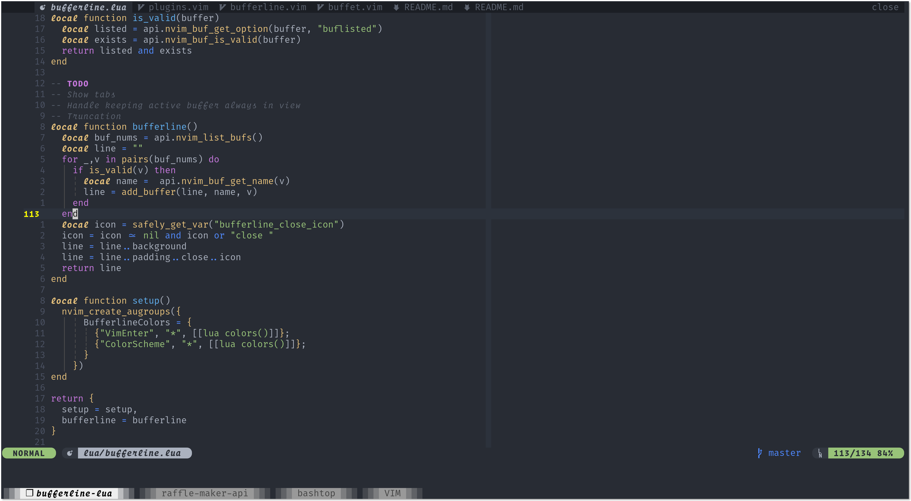

# nvim-bufferline



A _snazzy_ 😎💅 buffer line (with minimal tab integration) for **Neovim** built using `lua`.

🚧 **V. WIP** - Definitely not ready for anyone else's use ATM.

## Why another buffer line plugin?

1. I was looking for an excuse to play with `lua` and learn to create a plugin with it for **Neovim**.
2. I wanted to add some tweaks to my buffer line and didn't want to figure out a bunch of `vimscript` in some other plugin.

### Why make it public rather than as part of your `init.vim`

🤷🤷🤷

## Goals

- [ ] Make it snazzy
- [ ] Show LSP diagnostics in bufferline so it's clear which buffers have errors
- [ ] Show only the buffers relevant/open in a specific tab as a configurable setting
- [ ] A _few_ different configuration options for filenames

## Non-goals

- Supporting `vim` please don't ask. The whole point was to create a `lua` plugin. If vim ends up supporting `lua` in the _same_ way then **maybe**.
- Add every possible feature under the sun ☀, to appease everybody 🤷.
- Create and maintain a monolith ⛏ 😓.

## Installation

😅 _Don't_, not yet anyway

```vim
Plug 'Akin909/nvim-bufferline'
```
