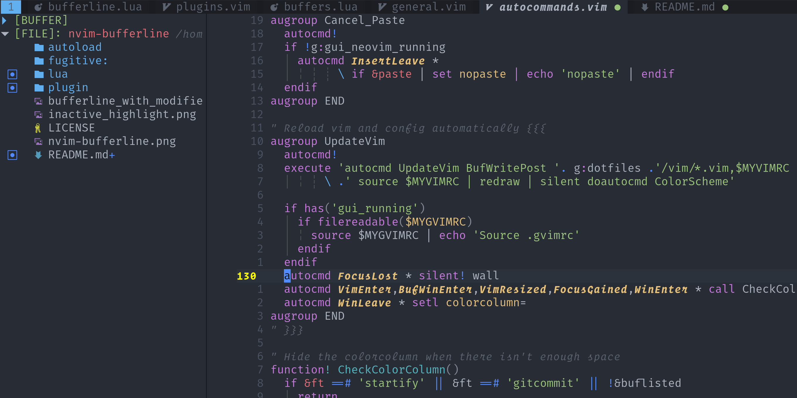

# nvim-bufferline.lua

A _snazzy_ 💅 buffer line (with minimal tab integration) for Neovim built using **lua**.



**Status: 🚧 WIP**

## Why another buffer line plugin?

1. I was looking for an excuse to play with **lua** and learn to create a plugin with it for Neovim.
2. I wanted to add some tweaks to my buffer line and didn't want to figure out a bunch of `vimscript` in some other plugin.

### Why make it public rather than as part of your `init.vim`

🤷 figured someone else might like the aesthetic. Don't make me regret this...

## Goals

- [x] Make it snazzy
- [x] Maintain general appearance across various colorschemes. Tested with:
  - `one.vim`
  - `night-owl.vim`
  - `vim-monokai-tasty`
- [ ] Show LSP diagnostics in bufferline so it's clear which buffers have errors
- [ ] Show only the buffers relevant/open in a specific tab as a configurable setting
- [ ] A _few_ different configuration options for file names

## Non-goals

- Supporting vim please don't ask. The whole point was to create a lua plugin. If vim ends up supporting lua in the _same_ way then maybe.
- Add every possible feature under the sun ☀, to appease everybody.
- Create and maintain a monolith 😓.

## Todo

### Urgent

- [x] Expose user configuration
- [ ] Fix truncation happening too early i.e. available width reported incorrectly
- [x] Fix modified highlight coloring

### Longterm

- [x] Show tabs
- [x] Handle keeping active buffer always in view
- [x] Show remainder marker as <- or -> depending on where truncation occured
- [x] Fix current buffer highlight disappearing when inside ignored buffer
- [x] Dynamically set styling to appear consistent across colorschemes
- [ ] Buffer label truncation
- [ ] Highlight file type icons if possible see [for example](https://github.com/weirongxu/coc-explorer/blob/59bd41f8fffdc871fbd77ac443548426bd31d2c3/src/icons.nerdfont.json#L2)

## Installation

Super early days there might be some breaking changes, if you use this
without configuring it this shouldn't affect you too much.

```vim
Plug 'Akin909/nvim-bufferline.lua'
```

## Usage

```vim
" In your init.vim AFTER loading plugins
lua require'bufferline'.setup()
```

This plugin is designed to work automatically, deriving colours from the user's theme,
but if you must...

```vim
lua require'bufferline'.setup{
    bufferline_tab = {
      guifg = comment_fg,
      guibg = normal_bg,
    };
    bufferline_tab_selected = {
      guifg = comment_fg,
      guibg = tabline_sel_bg,
    };
    bufferline_buffer = {
      guifg = comment_fg,
      guibg = custom_bg,
    };
    bufferline_buffer_inactive = {
      guifg = comment_fg,
      guibg = normal_bg,
    };
    bufferline_modified = {
      guifg = diff_add_fg,
      guibg = "none"
    };
    bufferline_separator = {
      guibg = custom_bg,
    };
    bufferline_selected = {
      guifg = normal_fg,
      guibg = normal_bg,
      gui = "bold,italic",
    };
}
```
