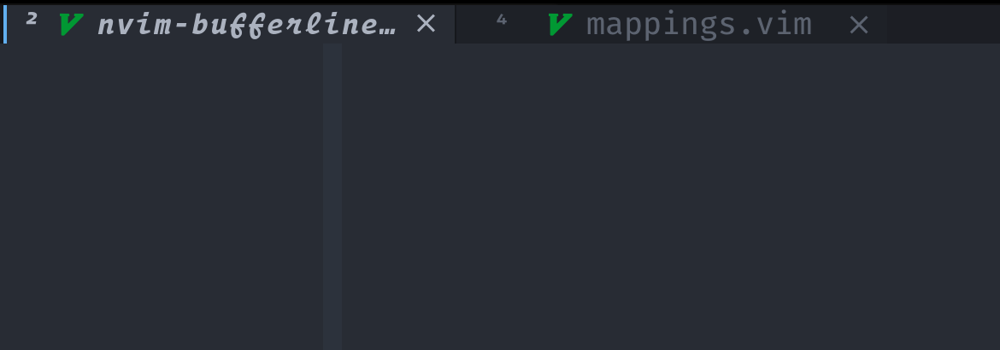
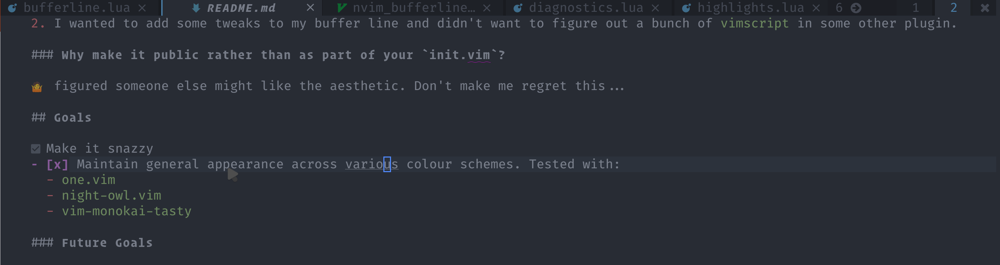

# nvim-bufferline.lua

A _snazzy_ 💅 buffer line (with minimal tab integration) for Neovim built using **lua**.


This plugin shamelessly attempts to emulate the aesthetics of GUI text editors/Doom Emacs.
It was inspired by a screenshot of DOOM Emacs using [centaur tabs](https://github.com/ema2159/centaur-tabs). I don't intend to copy
all of it's functionality though.

## Features

- Colours derived from colorscheme where possible, should appear similar in most cases

- Option to show buffer numbers

  

- Buffer pick functionality

  

- Sort buffers by `extension`, `directory` or pass in a custom compare function

- Close icons for closing individual buffers

- Modified symbol


## Requirements

- Nightly nvim
- A patched font (see [nerd fonts](https://github.com/ryanoasis/nerd-fonts))

## Installation

Super early days there might be some breaking changes, if you use this
without configuring it this shouldn't affect you too much.

```vim
Plug 'kyazdani42/nvim-web-devicons' " Recommended (for coloured icons)
" Plug 'ryanoasis/vim-devicons' Icons without colours
Plug 'akinsho/nvim-bufferline.lua'
```

If using native packages make sure to add this plugins in the `/pack/*/opt`
directory. This is because plugins in the `/start` directory are not loaded until
after your `init.vim` is processed which will be too late.

```vim
packadd! nvim-bufferline.lua
" then call setup sometime after this
```

## Usage

You need to be using `termguicolors` for this plugin to work, as it reads the hex `gui` color values
of various highlight groups.

```vim
set termguicolors
" In your init.vim AFTER loading plugins
lua require'bufferline'.setup()
```

You can close buffers by clicking the close icon or by _right clicking_ the tab anywhere

## Warning

This plugin relies on some basic highlights being set by your colour scheme
i.e. `Normal`, `String`, `TabLineSel` (`WildMenu` as fallback), `Comment`.
It's unlikely to work with all colour schemes, which is not something I will fix tbh.
You can either try manually overriding the colours or manually creating these highlight groups
before loading this plugin.

If the contrast in your colour scheme is too high, think an all black colour scheme, this
plugin won't create a nice tabline.

## Why another buffer line plugin?

1. I was looking for an excuse to play with **lua** and learn to create a plugin with it for Neovim.
2. I wanted to add some tweaks to my buffer line and didn't want to figure out a bunch of `vimscript` in some other plugin.

### Why make it public rather than as part of your `init.vim`?

🤷 figured someone else might like the aesthetic. Don't make me regret this...

## Goals

- [x] Make it snazzy
- [x] Maintain general appearance across various colour schemes. Tested with:
  - `one.vim`
  - `night-owl.vim`
  - `vim-monokai-tasty`

### Future Goals

- [x] Show only the buffers relevant/open in a specific tab as a configurable setting
- [ ] Show LSP diagnostics in bufferline so it's clear which buffers have errors

## Non-goals 🙏

- Appeal to every single person's tastes. This plugin is opinionated about how the tabline
  looks, it's unlikely to please everyone, I don't want to try and support a bunch of different
  appearances.
- Supporting vim please don't ask. The whole point was to create a lua plugin. If vim ends up supporting lua in the _same_ way then maybe.
- Add every possible feature under the sun ☀, to appease everybody.
- Create and maintain a monolith 😓.

## Todo

- [ ] Write nvim help docs
- [x] Highlight file type icons [for example](https://github.com/weirongxu/coc-explorer/blob/59bd41f8fffdc871fbd77ac443548426bd31d2c3/src/icons.nerdfont.json#L2)
- [x] Expose user configuration
- [x] Fix truncation happening too early i.e. available width reported incorrectly
- [x] Fix modified highlight colouring
- [x] Show tabs
- [x] Handle keeping active buffer always in view
- [x] Show remainder marker as <- or -> depending on where truncation occurred
- [x] Fix current buffer highlight disappearing when inside ignored buffer
- [x] Dynamically set styling to appear consistent across colour schemes
- [x] Buffer label truncation

## Configuration

```lua
require'bufferline'.setup{
  options = {
    view = "multiwindow" | "default",
    numbers = "none" | "ordinal" | "buffer_id",
    number_style = "superscript" | "",
    mappings = true | false,
    buffer_close_icon= '',
    modified_icon = '●',
    close_icon = '',
    left_trunc_marker = '',
    right_trunc_marker = '',
    max_name_length = 18,
    tab_size = 18,
    show_buffer_close_icons = true | false,
    -- can also be a table containing 2 custom separators
    -- [focused and unfocused]. eg: { '|', '|' }
    separator_style = "thick" | "thin" | { 'any', 'any' },
    enforce_regular_tabs = false | true,
    always_show_bufferline = true | false,
    sort_by = 'extension' | 'directory' | function(buffer_a, buffer_b)
      -- add custom logic
      return buffer_a.modified > buffer_b.modified
    end
  }
}
```

### Regular tab sizes

Generally this plugin enforces a minimum tab size so that the buffer line
appears consistent. Where a tab is smaller than the tab size it is padded.
If it is larger than the tab size it is allowed to grow up to the max name
length specified (+ the other indicators).
If you set `enforce_regular_tabs = true` tabs will be prevented from extending beyond
the tab size and all tabs will be the same length

### Sort by `...`

Bufferline allows you to sort the visible buffers by `extension` or `directory`, or for more
advanced usage you can provide a custom compare function which will receive two buffers to compare.
You can see what fields are available to use using

```lua
sort_by = function(buffer_a, buffer_b)
  print(vim.inspect(buffer_a))
-- add custom logic
  return buffer_a.modified > buffer_b.modified
end
```

When using a sorted bufferline it's advisable that you use the `BufferLineCycleNext` and `BufferLineCyclePrev`
commands since these will traverse the bufferline bufferlist in order whereas. `bnext` and `bprev` will cycle
buffers according to the buffer numbers given by vim

### Bufferline Pick functionality (inspired by [`barbar.nvim`](https://github.com/romgrk/barbar.nvim))

Using the `BufferLinePick` command will allow for easy selection of a buffer in view.
Trigger the command, using `:BufferLinePick` or better still map this to a key, e.g.

```vim
nnoremap <silent> gb :BufferLinePick<CR>
```

then pick the a buffer by typing the character for that specific
buffer that appears


### Multi-window mode (inspired by [`vem-tabline`](https://github.com/pacha/vem-tabline))

When this mode is active, for layouts of multiple windows in the tabpage,
only the buffers that are displayed in those windows are listed in the
tabline. That only applies to multi-window layouts, if there is only one
window in the tabpage, all buffers are listed.

### Mappings

If the `mappings` option is set to `true`. `<leader>`1-9 mappings will
be created to navigate the first to the tenth buffer in the bufferline.
**This is false by default**. If you'd rather map these yourself, use:

```vim
nnoremap mymap :lua require"bufferline".go_to_buffer(num)<CR>
```

### Highlight configuration

This plugin is designed to work automatically, deriving colours from the user's theme,
but if you must...

```vim
lua require'bufferline'.setup{
  highlights = {
    bufferline_tab = {
      guifg = comment_fg,
      guibg = normal_bg,
    };
    bufferline_tab_selected = {
      guifg = comment_fg,
      guibg = tabline_sel_bg,
    };
    bufferline_buffer = {
      guifg = comment_fg,
      guibg = custom_bg,
    };
    bufferline_buffer_inactive = {
      guifg = comment_fg,
      guibg = normal_bg,
    };
    bufferline_modified = {
      guifg = diff_add_fg,
      guibg = "none"
    };
    bufferline_separator = {
      guibg = custom_bg,
    };
    bufferline_selected = {
      guifg = normal_fg,
      guibg = normal_bg,
      gui = "bold,italic",
    };
  };
}
```
